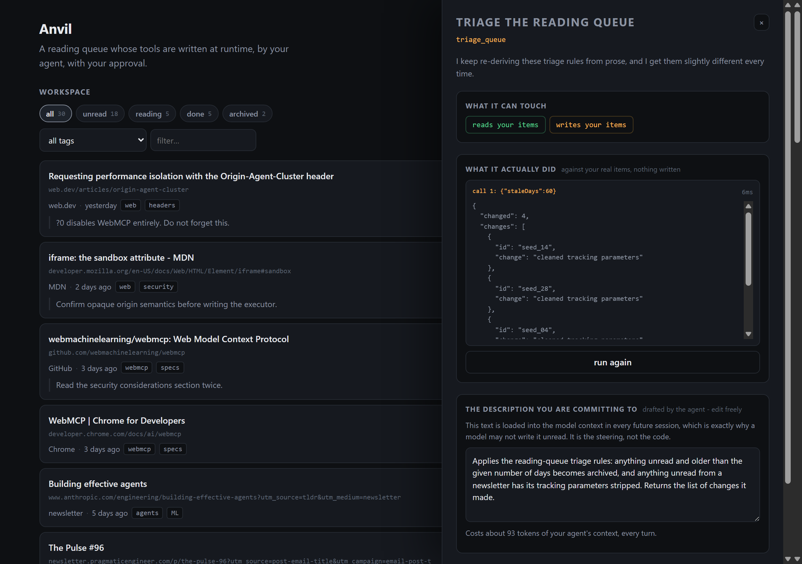

# Anvil

[](https://github.com/11HimanshuSharma/anvil/actions/workflows/ci.yml)

**A workspace whose tools are written at runtime, by your agent, with your approval.**

- **Repo:** https://github.com/11HimanshuSharma/anvil
- **Live URL:** _(pending first deploy)_
- **Demo video:** _(pending)_

WebMCP's own framing is that a *site* declares the tools it exposes — the question is "what can a site let an agent do?", and the developer chooses the answer at build time. Anvil asks the adjacent question: what if the user chooses, at runtime? the moment your agent nails a fiddly task, you turn that one-off success into a permanently callable WebMCP tool. The agent writes the code, you approve the behaviour and own the wording, and it registers live — no reload, no deploy, no OAuth flow.

## The problem: procedural drift

You explain your idiosyncratic way of doing something. The agent does it well. Next session it does it *slightly* differently, because prose gets re-interpreted every time it is read. Memory does not fix this — prose **is** the problem.

A tool is the opposite of prose: frozen behaviour, same input, same output, indefinitely.

## How WebMCP is used

Tools register on the top-level document, imperatively, with feature detection across the deprecated `navigator.modelContext` and a local shim so the app stays usable in browsers without WebMCP.

```js
document.modelContext.registerTool({
  name: "search_items",
  title: "Search saved links",
  description:
    "Searches the saved links by matching text against title, URL, notes, and tags. " +
    "Returns matching items with their ids, titles, URLs, tags, and status. Use this to " +
    "find specific items by keyword before reading or updating them.",
  inputSchema: {
    type: "object",
    properties: {
      query:  { type: "string", description: "Text to match. Case-insensitive substring match." },
      status: { type: "string", enum: ["unread", "reading", "done", "archived"] },
      limit:  { type: "number", description: "Maximum results to return. Defaults to 20." },
    },
    required: ["query"],
    additionalProperties: false,
  },
  annotations: { readOnlyHint: true },
  execute: async ({ query, status, limit = 20 }) => ({ items: await searchItems(query, status, limit) }),
}, { signal: abortController.signal });
```

Verified against the [WebMCP specification](https://webmachinelearning.github.io/webmcp/) and [Chrome's imperative API docs](https://developer.chrome.com/docs/ai/webmcp/imperative-api), not against second-hand summaries. Three facts shape [`src/webmcp/registry.ts`](src/webmcp/registry.ts):

1. **There is no `unregisterTool()`.** You unregister by aborting the `AbortSignal` you passed to `registerTool`.
2. **`registerTool` resolves once the tool is registered.** The signal's abort steps also reject that promise, but rejecting an already-settled promise is a no-op, so the ordinary unregister path is quiet. The `.catch()` at the call site is for the cases that genuinely reject: an already-aborted signal, a duplicate name, or an abort that lands mid-registration.
3. **The spec documents an unregister/re-register race**, so every lifecycle operation runs through one serialized queue, and `toolchange` is raced against a 50 ms timer rather than depended on for correctness — the spec is explicit that its timing "cannot be relied upon".

### The bug the shim was hiding

`executeTool` does **not** take a tool name. It takes the `RegisteredTool` object from `getTools()` and resolves with a **`DOMString`** — the JSON-serialised result:

```js
const tools = await document.modelContext.getTools();
const tool  = tools.find((t) => t.name === 'search_items');
const raw   = await document.modelContext.executeTool(tool, { query: 'mvcc' });
const result = JSON.parse(raw);
```

An earlier version of the local shim invented `executeTool(name, argsObject) → object`. Every in-page call passed locally and would have thrown in Chrome and in ChatGPT — the one place it mattered. The shim now models the real contract, three conformance assertions guard it, and every in-page call goes through one `callTool()` helper in [`src/webmcp/context.ts`](src/webmcp/context.ts).

That helper also papers over a genuine disagreement between sources: the spec's IDL declares `object inputObject`, while Chrome's documentation passes a JSON string. It tries the object form and falls back to the string form on a `TypeError`. Worth a spec issue.

One more: WebMCP's `ToolAnnotations` dictionary declares only `readOnlyHint` and `untrustedContentHint`. MCP's `destructiveHint` / `idempotentHint` are silently dropped by the WebIDL conversion, so Anvil no longer sets them — a hint that never reaches the agent is worse than none, because in review it reads as though it did.

## The loop

```
  agent: propose_tool(name, description, inputSchema, code, capabilities, rationale)
      │        no registry import in this file. no code path from an agent call to a live tool.
      ▼
  draft is dry-run against your real items in the sandbox — writes are computed, not applied
      ▼
  review drawer opens:   what it can touch  →  what it actually did  →  the words you own  →  source
      ▼
  human clicks Approve, having accepted (and usually edited) the description
      ▼
  descriptionAccepted = true  →  persisted  →  registry.register()  →  toolchange  →  callable
```

`propose_tool` returns `{ status: "pending_review", registered: false, callable: false }` and its description tells the agent to stop and wait. **Agents cannot approve their own tools**, because nothing in `src/tools/meta.ts` can reach the registry.



### Why approval is behavioural, not textual

Showing someone forty lines of JavaScript and asking "approve?" is security theatre — the audience who cannot stand up an MCP server cannot audit JavaScript either. The drawer instead shows, in order:

1. **What it can touch** — capability chips: *reads your items* / *writes your items* / *reaches the network: `host`* / *pure computation — touches nothing*
2. **What it actually did** — the draft dry-run against your real items, with the mutations it *would* have made rendered as a diff. Nothing is written.
3. **The description you're committing to** — editable, pre-filled with the agent's draft and flagged as agent-authored, with its context cost in tokens.
4. **Source** — collapsed, for the few who want it.

The split is deliberate: **the agent supplies the code, the human supplies the prose.** Code is sandboxed and capability-scoped, so it cannot steer the model. Descriptions *are* the steering mechanism — they load into the model's context in every future session — so a model-authored description is never registered until a human accepts the wording.

## Tool surface entropy

Every tool you keep is context your agent carries into every turn, and overlapping tools make it worse at choosing between them. A surface that grows by accretion degrades as you invest in it: three months in you have `normalize_company`, `clean_company_name` and `fix_employer_field`, and the agent picks wrong.

[`src/surface/entropy.ts`](src/surface/entropy.ts) is a crude but real answer — no embeddings, no API calls:

```
score = 0.6 · jaccard(description tokens) + 0.4 · trigram(name)      ≥ 0.55 → overlapping
```

Three consequences, all shipped:

1. A proposal that overlaps an existing tool makes **"Extend `existing_tool` instead"** the drawer's primary action, demoting "Approve as a new tool anyway" to secondary.
2. The surface panel shows a live context-cost meter — *"8 tools · ~1,771 tokens of definitions · 4 read, 4 write"* — plus per-tool usage (*"2 calls, last today"* / *"never called"*).
3. Tools that stop earning their keep get a **retire?** chip, which unregisters and archives them, freeing the context their definition was costing.

The threshold is **calibrated, not guessed** (`npm run calibrate`):

```
should flag      0.346 .. 0.600   (same job, different name)
should not flag  0.000 .. 0.078   (genuinely different jobs)
threshold 0.25 — all 6 labelled pairs classified correctly
```

It started at 0.55, which sat *inside* the should-flag range and silently missed two of three real duplicates, including `triage_queue` vs `triage_reading_queue` — the exact fragmentation the feature exists to prevent. An e2e test caught it. The calibration runs in CI, so the number cannot drift back into hand-waving.

## Security model

This app takes the spec's tool-poisoning attack and makes it *persistent and user-blessed*, so it has to be answered directly.

| Threat | Mitigation |
| --- | --- |
| Persistent prompt injection via description | A human must accept the description text. `descriptionAccepted` gates registration and nothing but the Approve button sets it. The agent's draft is shown flagged. |
| Malicious code | Opaque-origin iframe, no ambient credentials, capability-gated host RPC, enforced parent-side |
| Runaway execution | 3 s watchdog; the frame is destroyed and rebuilt |
| Data exfiltration | No network capability by default; https-only, exact-hostname allowlist; `credentials: 'omit'`; `redirect: 'error'`; 256 kB cap |
| Untrusted output steering the model | Every custom tool registers with `annotations: { untrustedContentHint: true }` |
| Agent self-approving | No tool can register a tool. `propose_tool` returns a pending status; there is no code path from an agent call to a live registration. |
| Over-parameterised privacy leak | Schemas are user-visible; the scanner flags fields unrelated to a reading queue |
| Context blowout | Results are capped at 64 kB before they reach the model, and host calls at 200 per execution |

### Two isolation levels, chosen at runtime

Some embedded browsers refuse to run scripts in a `src`-loaded `sandbox="allow-scripts"` iframe at all. Failing silently there would break every custom tool, and silently downgrading the boundary would be worse. So Anvil detects it, says what is lost, and offers the weaker option behind an explicit click.

| | `isolated` (default) | `reduced` (consent-gated fallback) |
| --- | --- | --- |
| Executor | iframe at an **opaque origin** | same-origin Web Worker |
| Workspace database | unreachable | reachable if a global is recovered |
| Deleted globals | defence in depth | the *only* barrier |
| Kill switch | remove the frame from the DOM | `worker.terminate()` |
| Capability enforcement | parent-side, per execution | parent-side, per execution |

A test proves the difference instead of asserting it. It recovers a deleted global through the prototype chain — `Reflect.get(proto, 'indexedDB', globalThis)` — and then tries to use it:

```
isolated:  not recoverable            (opaque origin holds)
reduced:   RECOVERED AND USABLE       (reduced isolation, as advertised)
```

That is exactly why the fallback needs a click. Run the whole suite against it with `npm run test:fallback`.

**What the sandbox actually guarantees.** User code runs in an iframe with `sandbox="allow-scripts"` and **no** `allow-same-origin`, which gives it an **opaque origin**. That is the boundary: no access to our IndexedDB, localStorage or cookies, no parent DOM, and any fetch it managed would be credential-less and cross-origin. Deleting `fetch`, `indexedDB` and friends inside the frame is defence in depth, *not* the boundary — a determined script can often recover a global; it cannot recover an origin.

Compare a Web Worker, the obvious alternative: a worker is **same-origin**, so it can reopen IndexedDB and issue credentialed fetches. Deleting globals there would be the only thing standing between user code and your data.

The frame's only channel out is a `MessageChannel` port the harness keeps in a closure, so tool code cannot forge host calls or results — it can only reach the host through the frozen `host` object its capabilities earned it. Capabilities are re-checked on the parent side on every call, keyed to the active execution, so a `host` object stashed by an earlier tool stops working.

**Honest limits.** The executor is served from a path on the same host with its own CSP (`'unsafe-eval'` confined to `/sandbox/`, the app's own pages strict). The opaque origin does the security work, but a genuinely separate origin would add defence against a future edit that mistakenly adds `allow-same-origin`; set `VITE_SANDBOX_ORIGIN` to a second deployment to get it. One frame is reused across executions, so tools can pollute each other's globals — a correctness wart, not a capability leak, since capabilities are enforced per execution on the parent side.

## Tests

**66 assertions**, all driving a real headless Chrome over the DevTools protocol. They run in CI on every push.

```bash
npm test
```

- **`npm run test:sandbox`** — 21 containment assertions, one per claim in the table above: opaque-origin storage denial, no parent DOM, capability shape *and* parent-side enforcement, watchdog kill and recovery, result cap, host-call cap, network allowlist including a successful fetch. Open [`/sandbox-tests.html`](sandbox-tests.html) to watch it run.
- **`npm run test:fallback`** — the same 21 against the reduced-isolation worker, so the degraded path is not a code path nobody executes.
- **`npm run test:e2e`** — 36 assertions across the whole loop: the cold-open demo, propose → dry-run → the drawer's real UI → an in-progress description edit surviving a re-render → a second proposal queueing instead of hijacking the drawer → a real click on Approve → live registration with no reload → the agent calling the tool → idempotency → duplicate-name refusal → Escape-to-dismiss → survives a reload → the injection scanner flagging a poisoned description and credential-shaped schema → overlap detection making consolidation primary → a retire chip freeing the context a tool cost.

These caught real bugs that would otherwise have died on camera:

- `new Function` builds a **synchronous** function, so `await` in tool code was a syntax error — while every host call returns a promise. Every agent-written tool would have failed.
- After the watchdog killed a `while(true)` frame, its replacement lost the race to load and the sandbox never recovered.
- The review drawer rebuilt its textarea on every re-render, silently discarding an in-progress description edit — in the one place where losing the wording matters most.

## Does it actually stay the same?

`npm run measure` reseeds the workspace to an identical starting state, runs the registered tool, and compares exact output across trials:

```
WITH THE TOOL — 10 trials, workspace reseeded before each
  identical results   10/10
  distinct outputs    1
  mean wall clock     120ms
```

The other arm — the same procedure asked of an agent in prose, in 10 fresh chats — needs a live agent and is not automatable. The script prints the exact protocol for running it by hand. Reporting only the arm that flatters the project would make the number worthless.

> **Note on preview panes:** a `src`-loaded `sandbox="allow-scripts"` iframe runs scripts in real Chrome, but not in every embedded preview pane. That is what the reduced-isolation fallback exists for.

## Layout

```
src/
  webmcp/      context (detect + shim), registry (serialized lifecycle), types
  sandbox/     host (iframe lifecycle, watchdog, capability enforcement, net proxy)
               protocol (wire types + limits), workspace (live vs dry-run sessions)
  store/       idb schema, items, tools, proposals, audit, seed
  tools/       builtin (5), meta (propose/dry-run/list), custom (ToolDef → ModelContextTool)
  surface/     entropy (overlap, context cost, retirement), scan (injection flags)
  ui/          items, surfacePanel, drawer, auditLog, dom
public/sandbox/executor.html    the opaque-origin executor
public/sandbox/worker.js        the consent-gated reduced-isolation fallback
probe.html                      the day-one live-registration probe, still green
scripts/                        headless-Chrome test drivers
```

## Run locally

```bash
npm install
npm run dev
```

Open <http://localhost:5173>. `npm run build` runs `tsc --noEmit` first, so a type error fails the build. Strict mode is on, including `noUncheckedIndexedAccess` and `exactOptionalPropertyTypes`.

To use it with an agent: open the deployed HTTPS URL in the ChatGPT desktop app's in-app browser (GPT-5.6 Sol or Terra — Luna has WebMCP disabled, and it is unavailable in Enterprise/Edu workspaces), or enable `chrome://flags/#enable-webmcp-testing` in Chrome 149+. Without either, the app runs against a local shim and is fully usable; the badge says so.

## Deployment

Headers matter more than usual: WebMCP needs a secure context and an origin-isolated document, and `Origin-Agent-Cluster: ?0` disables it entirely. See [`vercel.json`](vercel.json) — note the negative lookahead, which keeps the strict app CSP from intersecting with the executor's and stripping `unsafe-eval` back out.

```bash
curl -sI https://<your-url> | grep -i -E 'origin-agent|permissions-policy|content-security'
```

## Known limitations

- **The `net` capability is bounded by the deployment's CSP.** The proxy fetch runs on the app's own origin, so `connect-src` is an outer bound that a per-tool allowlist cannot widen: a tool may request `api.example.com`, but if the deployed `connect-src` does not list it, the browser blocks the request before it leaves. The proxy returns an error saying exactly that rather than a bare "Failed to fetch". Read/write tools are unaffected.
- One executor is reused across executions, so tools can pollute each other's globals. A correctness wart, not a capability leak — capabilities are enforced per execution, parent-side.
- Toolpack export/import is not built.
- Retirement suggestions use a 14-day window, so they are invisible in a short demo. Append `?retire=0` to shorten it and see the chip; it changes when a *suggestion* appears, and retiring is still a click.
- `VITE_SANDBOX_ORIGIN` points the executor at a separate origin for defence in depth; using it also requires adding that origin to `frame-src` in [`vercel.json`](vercel.json).

## Submission

[`SUBMISSION.md`](SUBMISSION.md) holds the Devpost text, the video shot list, and the pre-submit checklist.

## License

MIT — see [LICENSE](LICENSE).
